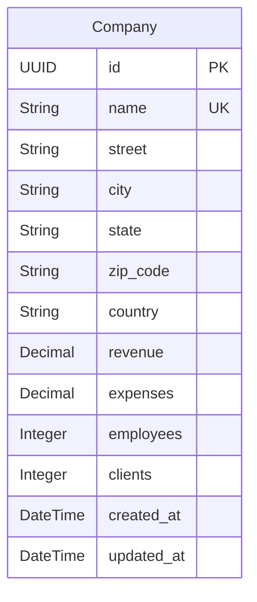

# Data Model Documentation

This document describes the data model for the FastReport application, including entity descriptions, field definitions, relationships, and an entity-relationship diagram.

## Model Descriptions

### 1. Company

Represents a company entity with financial data, employee/client counts, and address information. This is currently the only entity in the system.

**Table name:** `companies`

**Fields:**

| Field | Type | Constraints | Description |
|-------|------|-------------|-------------|
| `id` | UUID | PK, default=uuid4 | Unique identifier |
| `name` | String(255) | NOT NULL, UNIQUE, INDEX | Company name |
| `street` | String(255) | NULL | Street address |
| `city` | String(255) | NULL | City |
| `state` | String(100) | NULL | State/province |
| `zip_code` | String(20) | NULL | Postal/ZIP code |
| `country` | String(100) | NULL | Country |
| `revenue` | Numeric(15,2) | NOT NULL, default=0 | Total revenue |
| `expenses` | Numeric(15,2) | NOT NULL, default=0 | Total expenses |
| `employees` | Integer | NOT NULL, default=0 | Number of employees |
| `clients` | Integer | NOT NULL, default=0 | Number of clients |
| `created_at` | DateTime(tz) | NOT NULL, server_default=now() | Creation timestamp |
| `updated_at` | DateTime(tz) | NOT NULL, server_default=now(), onupdate=now() | Last update timestamp |

**Computed properties (domain entity):**
- `profit`: `revenue - expenses` (calculated property, not stored in DB)

**Indexes:**
- Primary key: `id` (UUID)
- Unique constraint: `name`
- Index: `ix_companies_name` on `name`

**Validation rules (Pydantic schema):**
- `name`: required, 1-255 characters
- `street`, `city`, `state`, `zip_code`, `country`: optional strings
- `revenue`, `expenses`: Decimal, defaults to 0
- `employees`, `clients`: integer, defaults to 0

## Entity Relationship Diagram

> **Note:** The current data model has a single entity. As new features are added, this document will be updated with additional entities and their relationships.

## Key Design Principles

1. **UUID Primary Keys**: All entities use UUID v4 as primary keys for globally unique, client-generatable identifiers.

2. **Server-managed Timestamps**: `created_at` and `updated_at` are managed at the database level via `server_default=func.now()` and `onupdate=func.now()`.

3. **Decimal for Money**: Financial fields (`revenue`, `expenses`) use `Numeric(15, 2)` to avoid floating-point precision issues.

4. **Soft Defaults**: Numeric fields default to 0 at both the application level (domain entity) and database level (`server_default`).

5. **Separation of Concerns**: The domain entity (`Company` dataclass) and ORM model (`CompanyModel`) are separate classes. Mapping between them is done via `_to_entity()` and `_to_model()` static methods in the repository.

6. **Computed vs Stored**: Business calculations like `profit` are computed properties on the domain entity, not stored columns. This avoids data inconsistency.

## Migration History

| Version | Description | Date |
|---------|-------------|------|
| 001 | Create companies table | Initial |
